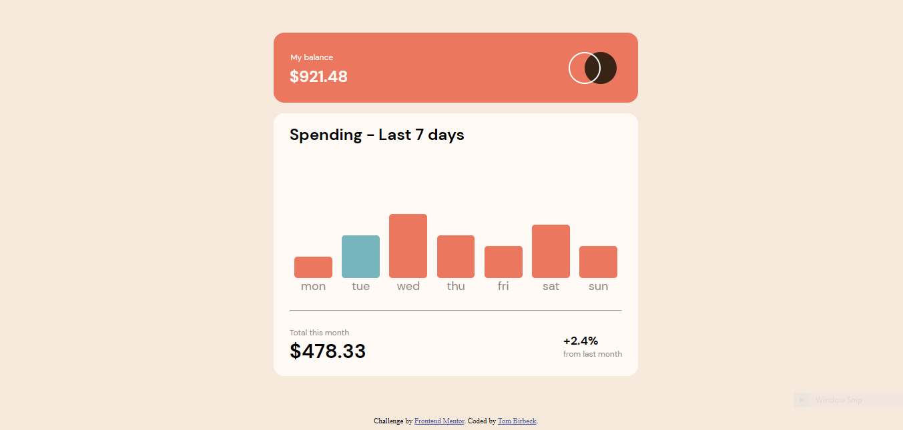

# Frontend Mentor - Expenses chart component solution

This is a solution to the [Expenses chart component challenge on Frontend Mentor](https://www.frontendmentor.io/challenges/expenses-chart-component-e7yJBUdjwt). Frontend Mentor challenges help you improve your coding skills by building realistic projects. 

## Table of contents

- [Overview](#overview)
  - [The challenge](#the-challenge)
  - [Screenshot](#screenshot)
  - [Links](#links)
- [My process](#my-process)
  - [Built with](#built-with)
  - [What I learned](#what-i-learned)
- [Author](#author)

## Overview

To recreate the desktop version of the challenge: 

### The challenge

Users should be able to:

- View the bar chart and hover over the individual bars to see the correct amounts for each day
- See the current day’s bar highlighted in a different colour to the other bars
- View the optimal layout for the content depending on their device’s screen size
- See hover states for all interactive elements on the page
- **Bonus**: Use the JSON data file provided to dynamically size the bars on the chart

### Screenshot

My solution: 

### Links

- Solution URL: [solution](https://your-solution-url.com)
- Live Site URL: [Live site](https://tombirbeck.github.io/frontend-mentor-expenses-chart/)

## My process

I began by making sure I removed and margin and padding on the page and adding a box-sizing of border box.
I then created the balance card and the chart card using html, giving each one a class so that I could style them easily. I created custom variables, import the correct font and styled each element.\
When I was happy with the initial layout of the page I began adding JavaScript. Firstly I captured the elements I need in variables, using the querySelectorAll for the bars so that I could iterate over them later. I imported the JSON data file using the fetch API and I used this and the bars array I had captured to set the correct heigts for each bar.
I also attached and event listener to each one so that the daily amount would show/hide on mouse entry/leaving.

### Built with

- Semantic HTML5 markup
- CSS custom properties
- Flexbox
- JavaScript

### What I learned

This challenge was useful because I learned how to change the size of an element using JavaScript.

## Author

- Website - [Tom Birbeck](https://portfolio-tombirbeck.vercel.app/)
- Frontend Mentor - [TomBirbeck](https://www.frontendmentor.io/profile/TomBirbeck)
